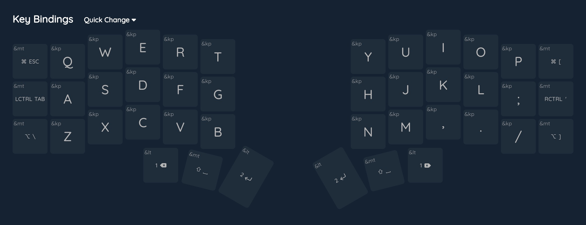
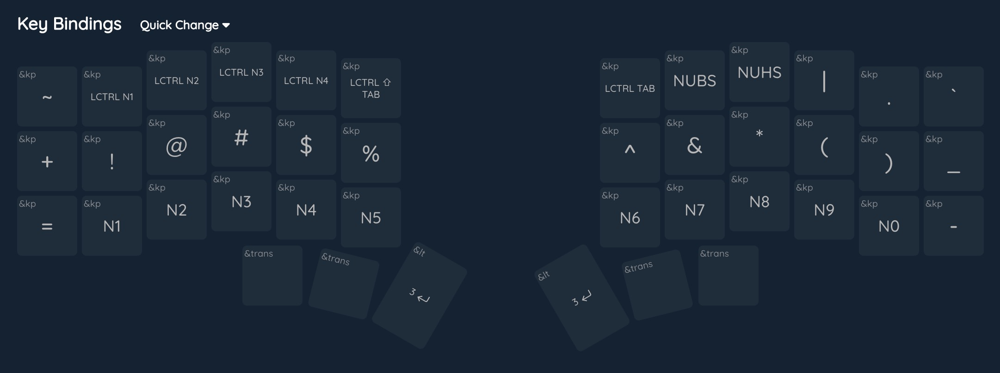
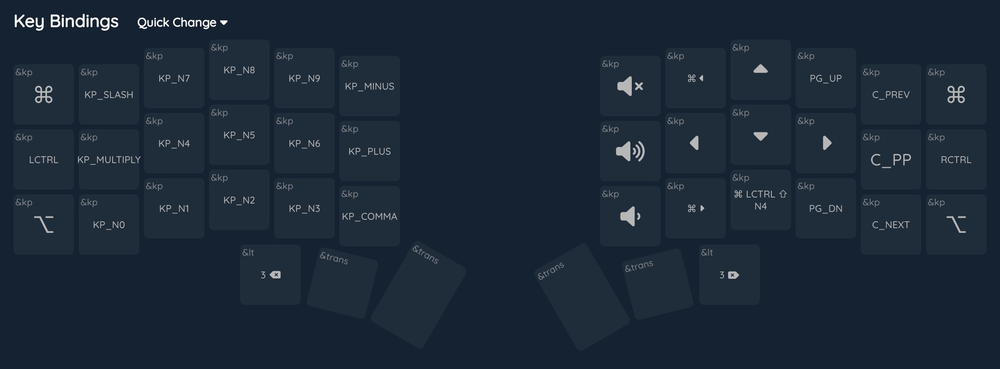
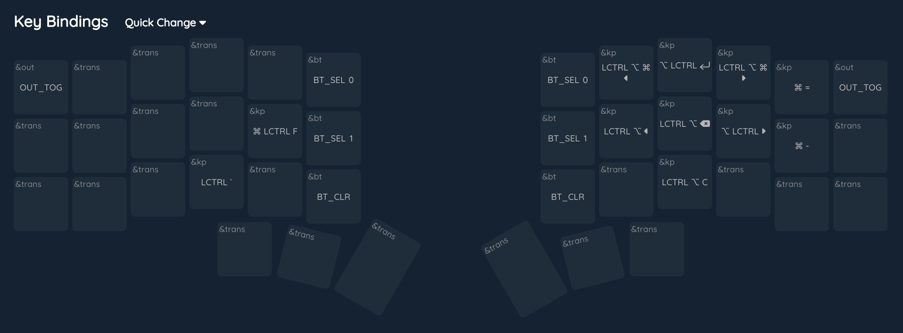
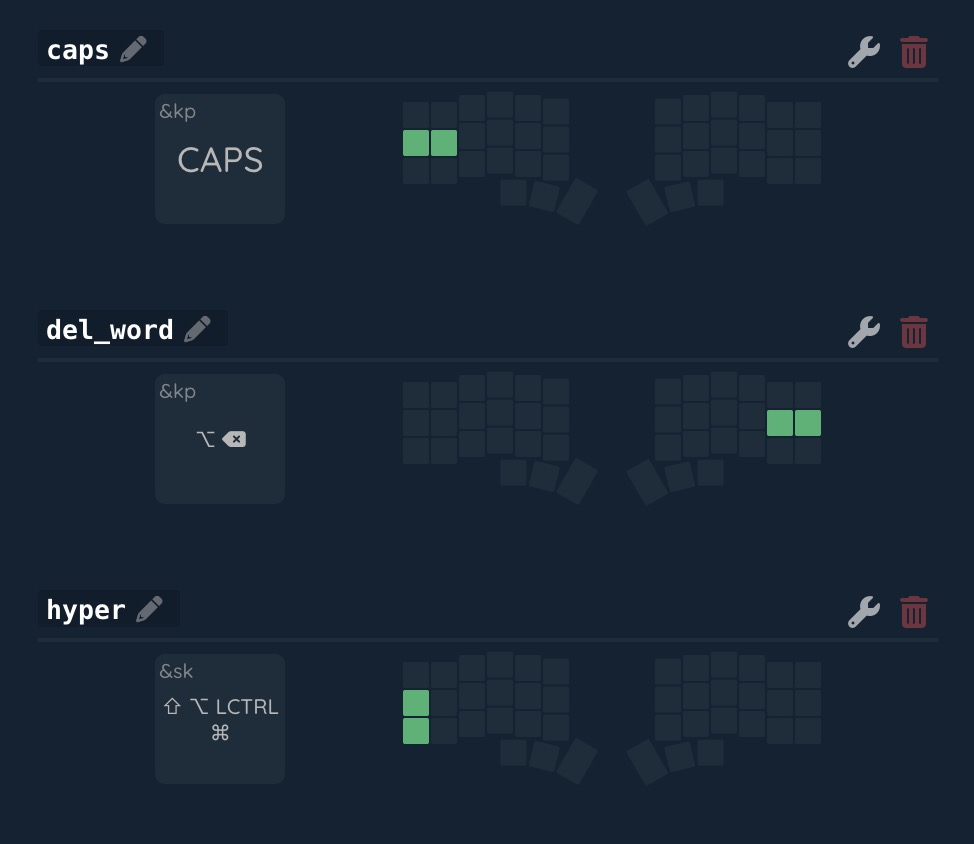

# Custom Corne keymap

Credits to _nickcoutsos_ for his [keymap-editor]
## Current layout:
Base layer (0)

Numbers layer (1)

Navigation layer (2)

Tiling layer (3)

Combos

[keymap-editor]:https://github.com/nickcoutsos/keymap-editor